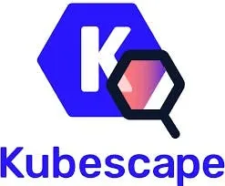
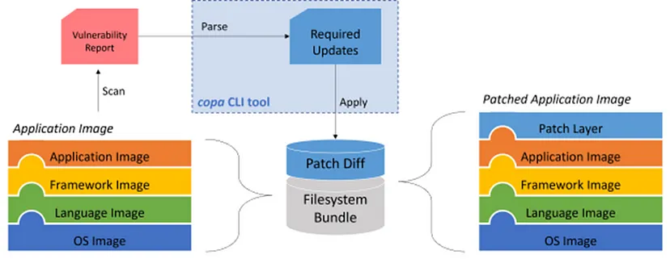
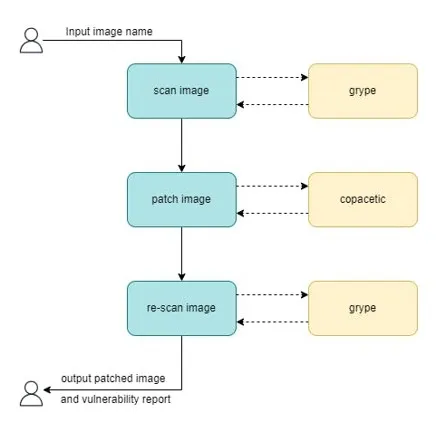
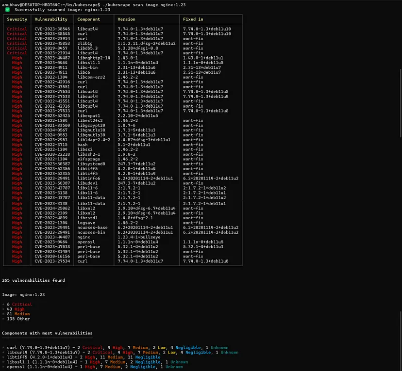
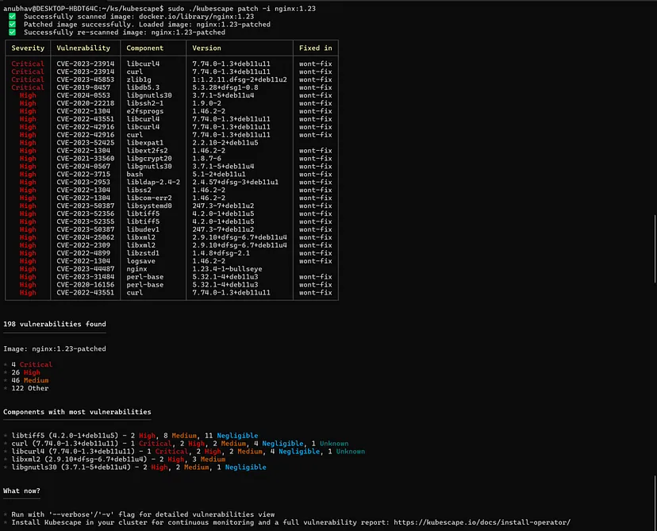

# Patching Image Vulnerabilities with Kubescape & Copa

In this article, we’ll learn how can we patch vulnerabilities in our container images using Kubescape & Copa.

---

<!-- more -->

## What is Kubescape? 🔍

<figure markdown>
  { width="200" }
</figure>

Kubescape is an open-source **Kubernetes security platform**. It includes risk analysis, security compliance, and misconfiguration scanning. Targeted at the DevSecOps practitioner or platform engineer, it offers an easy-to-use CLI interface, flexible output formats, and automated scanning capabilities. It saves Kubernetes users and admins precious time, effort, and resources.
Kubescape is a [Cloud Native Computing Foundation (CNCF) sandbox project](https://www.cncf.io/sandbox-projects/).

---

## What are Image Vulnerabilities? 💀👾

<figure markdown>
  { width="600" }
</figure>

Container images can contain security vulnerabilities that can be exploited by attackers. These vulnerabilities can include outdated software versions, unpatched vulnerabilities, or weak encryption protocols. Container image vulnerabilities can be identified through vulnerability scanning tools that analyze container images and their dependencies.

On a broad scale, we can divide image vulnerabilities into 2 categories:

- **OS-Level Vulnerability:** These are vulnerabilities because of the underlying OS in your image. It is unrelated to your application code. For example: You are using alpine as the base image in your container image.
- **Application-Level Vulnerability:** These are vulnerabilities due to the source code of your application. For example: A SQL injection error in your code or an outdated python library/package which you are using in your software.

---

## What is Image Patching? 🩹

<figure markdown>
  { width="600" }
</figure>

Kubescape can “patch” or “fix” the vulnerabilities in your image with the help of Copa, by updating the packages to their applicable fixed-in versions.

Below is the architecture diagram of how [Copacetic](https://project-copacetic.github.io/copacetic/website/quick-start) can patch images:


<figure markdown>
  { width="600" }
  <figcaption>Architecture of copa</figcaption>
</figure>

1. Parses the needed update packages from the container image’s vulnerability report produced by a scanner like Kubescape.
2. Obtains and processes the needed update packages using the appropriate package manager tools such as apt, apk, etc.
3. Applies the resulting update binaries to the container image using buildkit.

---

## How does it work? ⚒️🤔

<figure markdown>
  { width="500" }
</figure>

Below is a small flowchart I made, to help you understand the Kubescape image patching process:

<figure markdown>
  { width="600" }
  <figcaption>Kubescape image patching process</figcaption>
</figure>

1. The user inputs the image which needs to be patched
2. Kubescape scans the image for vulnerabilities using Grype as its engine
3. Kubescape then uses the scanned image information to analyze the vulnerabilities and passes the report further to the patching process.
4. Kubescape then reads the vulnerability report and patches the applicable vulnerable packages in the image using Copacetic.
5. Kubescape re-scans the patched image for vulnerabilities using Grype as its engine.
6. In the CLI output, we have the vulnerability summary report and a patched image exported to our local Docker Server

---

## Demo 🧑‍💻 👀

<figure markdown>
  { width="600" }
</figure>

Let’s see the working in action.

Run the following command to scan the **“nginx:1.23”** image for vulnerabilities:

```bash
kubescape scan image nginx:1.23
```

We get the following output:

<figure markdown>
  { width="600" }
  <figcaption>Kubescape image scan output</figcaption>
</figure>

As we can see there are **265 vulnerabilities** which Kubescape has found in this image.

Let’s run the patch command on this image now:

```bash
kubescape patch -i nginx:1.23
```

We get the following output:

<figure markdown>
  { width="600" }
  <figcaption>Kubescape image patch output</figcaption>
</figure>

As we can see, we have a new image called **“nginx:1.23-patched”** and the total vulnerabilities has reduced to just 198 from 265!

Now, you might wonder — Why weren’t all the vulnerabilities patched and why do we still have 198 vulnerabilities which are not fixed? The answer lies in how image scanning and image patching works.

If you are familiar with any of the popular image scanning software like Grype/Trivy/Docker etc., it lists the following:

1. The particular package in your image which has a certain vulnerability. 
    *For example:* **libcurl4**
2. The current version of the package which is being used in your image.
    *For example:* **7.74.0–1.3+deb11u7**
3. The package version in which the vulnerability has been fixed.
    *For example:* **7.74.0–1.3+dev11u10**

If we update the package to the fixed-in version, the vulnerability will be fixed. However, there are certain packages which do not have a fix known yet. These are the vulnerabilities which security researchers are actively working on to find a fix. Therefore, these left vulnerabilities are those vulnerabilities which no one has a fix yet for.

---

## Conclusion

We needed the ability to patch containers quickly without going upstream for a full rebuild. As the window between [vulnerability disclosure and active exploitation continues to narrow](https://www.bleepingcomputer.com/news/security/hackers-scan-for-vulnerabilities-within-15-minutes-of-disclosure/), there is a growing operational need to patch critical security vulnerabilities in container images so they can be quickly redeployed into production. Kubescape & Copa can help you patch those OS-level vulnerabilities in your image quickly.

> If you are interested in knowing how I added this integration & support between Kubescape & Copa, checkout my [other story](https://anubhav-gupta.medium.com/lfx-mentorship-my-experience-c0c451839735).


